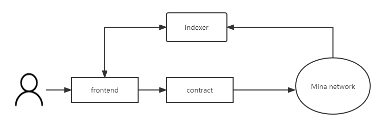

# nft-zkapp: a simple private NFT based on mina zkApp

Update: The reducer feature is no longer used, and zkProgram was used to develop rollup merged proof to prove the legality of state transitions.

This is a simple NFT project that tries to use snarkyjs's ~~actions/reducer feature~~ and merkle tree. It also uses mina's zk proof to protect the nft's owner address from being public. This project allows you to enter arbitrary short strings to mint nfts, protect your privacy by encrypting your address, and use zero-knowledge proofs to prove your ownership, please note that this is just a proof of concept project as ~~actions/reducer~~(zkProgram) is still an experimental feature and not available on qanet(This project mocks the simple functionality of a nft data indexer locally for testing).

## Off-chain NFT solution

In fact, the solution shown in this project requires developers or anyone else to run an indexer off-chain (a web service that monitors mina network events to update the merkle tree and provides NFT data and merkle proof data queries to the public).
The main function of this indexer is to monitor the state changes of the contract under the chain, and construct the merkle tree corresponding to the contract by obtaining sequence events from the mina network, and provide users with NFT data query services and merkle proof query services. Since any user can obtain the source code of indexer to run the indexer, get all the event data from mina's archive node and initiate rollup transactions in the contract, so we can consider this solution to be decentralized and permissionless.



## How to build

```sh
npm run build
```

## How to run test

```sh
npm run nft
```


## License

[Apache-2.0](LICENSE)
